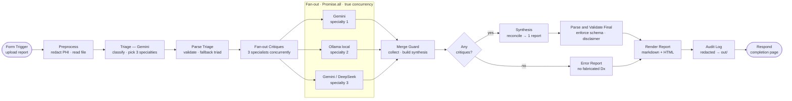

# Multi-LLM X-Ray Report Analysis Agent System

An n8n workflow that runs a **triage → three parallel specialist critiques →
synthesis** pipeline over a radiology report, using three independent LLM
backends (Gemini, local Ollama, DeepSeek), implementing `AGENT_SYSTEM_SPEC.md`
(the build specification; place a copy in this directory for reference —
section numbers cited below, e.g. "§2.6", refer to it).

```text
──────────────────────────────────────────────────────────────────────────
⚠  IMPORTANT — READ BEFORE USE
This report was produced by an AI-assisted research/educational tool. It is
NOT a certified diagnostic device and must not be treated as one.

• All output must be reviewed and confirmed by a licensed radiologist or
  physician before ANY clinical decision is made.
• This system must never be deployed to make diagnostic or treatment
  decisions autonomously. A qualified human must remain in the loop at all
  times.
• No real patient-identifying information should be entered, stored, or
  logged. All test and demonstration data must be de-identified.
──────────────────────────────────────────────────────────────────────────
```

**Design principle: scoped, auditable access beats blanket permissions for both
security and reliability.** This system is never granted "all permissions."

---

## Run it now (local runner — the working path)

The pipeline runs today via a standalone Node runner that executes the exact same
stages (triage → 3 concurrent specialist critiques → synthesis → render) against
the real backends, using Node's native `Promise.all` for true concurrency. No n8n
needed.

```powershell
# one report, opens the result in your browser
powershell -ExecutionPolicy Bypass -File "scripts\analyze.ps1" test-data\case-2-ambiguous.txt -Age 54 -Sex F -History "cough and low-grade fever x5 days"

# or directly
node scripts\run-local.mjs test-data\case-3-disagreement.txt --age 61 --sex M --history "30 pack-year smoker"
```

Reports (markdown + HTML) and a redacted `audit.jsonl` are written to `XRAY_OUT_DIR`
(`C:\xray-agent\out`). Keys and settings come from `C:\xray-agent\secrets.env`.

### This machine's tuned settings (in `secrets.env`)

Verified live on 2026-07-07; these overrides are already set:

- **`GEMINI_SPECIALIST_MODEL=gemini-2.5-flash`** — `gemini-3.5-flash` repeatedly
  timed out (60–90s+) here; 2.5-flash is fast and reliable (triage ~3s, synthesis ~20s).
- **`OLLAMA_MODEL=orca-mini`** — `llama3.1:8b` needs ~6 GB RAM and OOMs on this box;
  the 2 GB orca-mini fits. It's a weak 3B model, so its critique sometimes fails
  schema validation and is dropped (the pipeline handles this and notes it under
  *missing critiques*). For a stronger local critique, free ~6 GB RAM and set
  `OLLAMA_MODEL=llama3.1:8b`.
- **`XRAY_NO_DEEPSEEK=1`** — **your DeepSeek account currently has no balance**
  (`HTTP 402 Insufficient Balance`). This flag routes the two DeepSeek roles
  (specialist #3 + synthesis) to Gemini so you get a complete report now. **To use
  DeepSeek as designed, add credit at platform.deepseek.com and remove this line.**

## Repository layout

| Path | What it is |
|---|---|
| `scripts/run-local.mjs` | **Working runner** — runs the whole pipeline against live backends (no n8n) |
| `scripts/analyze.ps1` | One-command wrapper: warms Ollama, runs a report, opens the HTML result |
| `n8n/xray-report-analyzer.workflow.json` | The n8n workflow deliverable (see "n8n status" below) |
| `src/nodes/*.js` | Source for each n8n Code node (compiled into the workflow) |
| `scripts/build-workflow.mjs` | Assembles the workflow JSON (`npm run build`) |
| `scripts/simulate-pipeline.mjs` | Offline logic tests with mocked backends (`npm test`) |
| `schemas/` | SpecialistCritique + FinalDiagnosticReport JSON schemas |
| `prompts/PROMPTS.md` | Where each prompt template lives and how to edit it |
| `test-data/` | Synthetic, de-identified test reports (spec §5.2 cases 1–3) |
| `docs/TESTING.md` | Test plan, metrics, rubric, degraded-backend procedure |

## Pipeline (13 nodes)



Plain-text fallback for viewers without Mermaid:

```
Form Trigger → Preprocess (redact/OCR route) → Triage (Gemini HTTP) → Parse Triage
   → Fan-out Critiques (Code: Gemini + Ollama + DeepSeek via Promise.all, true concurrency)
   → Merge Guard → Any Critiques? ── yes → Synthesis (Gemini/DeepSeek HTTP) → Parse & Validate Final ─┐
                                 └── no  → Error Report ───────────────────────────────────────────────┤
   → Render Report → Audit Log → Respond
```

- **Fixed backend↔slot mapping** (Gemini/Ollama/DeepSeek); the **specialty
  persona is assigned per-report by triage** and injected into an identical
  specialist template. Only Gemini optionally sees the image; the final report
  always discloses that the other two agents analyzed text only.
- **Degradation, not failure:** a dead backend or malformed JSON (after one
  stricter retry) is skipped; synthesis runs on 2/3 or 1/3 and lists the gap in
  `missing_critiques`. Zero critiques → explicit "analysis could not be
  completed" — never a fabricated diagnosis. Synthesis failure → raw critiques
  + "synthesis unavailable" notice. The disclaimer is re-inserted verbatim by
  code and can never be dropped or altered by a model.

---

## Setup

### 1. Prerequisites (pinned, no runtime installs)

- **n8n** — pinned release `n8n@2.28.7` (requires Node ≥ 22.22; install with
  `npm install -g n8n@2.28.7`). Older 1.x releases refuse to run on Node 24.
- **Ollama** — pinned release, reachable from n8n, with the model **pre-pulled**:
  `ollama pull llama3.1:8b` (optionally a vetted medical fine-tune — validate first).
  If n8n runs in Docker, `localhost` is not the host: use
  `http://host.docker.internal:11434` (Mac/Windows) or the host LAN IP / shared
  Docker network (Linux).
- **API keys** for Gemini (Google AI Studio) and DeepSeek.
- **Verify current model IDs before production** — defaults are July-2026 GA
  (`gemini-2.5-flash` triage, `gemini-3.5-flash` specialist, `deepseek-v4-flash`
  specialist, `deepseek-v4-pro` synthesis, `llama3.1:8b` local); all overridable
  via env vars below. Legacy `deepseek-chat`/`deepseek-reasoner` sunset 2026-07-24.

### 2. Environment variables for the n8n process

```bash
# Required — keys used by the Fan-out Code node (see "Credentials" note below)
GEMINI_API_KEY=...
DEEPSEEK_API_KEY=...
OLLAMA_BASE_URL=http://host.docker.internal:11434

# Required for audit logging from the Code node
NODE_FUNCTION_ALLOW_BUILTIN=fs,path
XRAY_OUT_DIR=/data/xray-agent/out          # the ONLY writable directory

# Required for credential-store encryption
N8N_ENCRYPTION_KEY=<random secret, kept out of version control>

# Optional model overrides
GEMINI_TRIAGE_MODEL=gemini-2.5-flash
GEMINI_SPECIALIST_MODEL=gemini-3.5-flash
DEEPSEEK_SPECIALIST_MODEL=deepseek-v4-flash
DEEPSEEK_SYNTHESIS_MODEL=deepseek-v4-pro
OLLAMA_MODEL=llama3.1:8b
```

### 3. n8n credentials (for the HTTP Request nodes)

Create two **Header Auth** credentials and attach them when prompted after import:

- `Gemini API` — header name `x-goog-api-key`, value = key (used by *Triage*).
- `DeepSeek API` — header name `Authorization`, value `Bearer <key>` (used by *Synthesis*).

> **Documented deviation from spec §3.3:** n8n **Code nodes cannot read the
> encrypted Credentials store** (`this.getCredentials` is not exposed there), so
> the concurrent Fan-out node reads keys from the environment variables above.
> Keys are still never written into any node, workflow JSON, or this repo. If
> you require store-only credentials, use the spec's visual-branch variant
> (three HTTP Request nodes + a Merge node) at the cost of sequential execution.

### 4. Import & run

**Windows one-command path:** put your keys in `C:\xray-agent\secrets.env`
(template is generated with placeholders), then:

```powershell
powershell -ExecutionPolicy Bypass -File scripts\start-n8n.ps1
```

The launcher loads the secrets, upserts both credentials (fixed IDs
`XrayGeminiCred01`/`XrayDeepSeekCr01`, so the workflow nodes stay attached),
upserts the workflow (fixed ID `XrayReportAnal01`), preflights Ollama, and
starts n8n. Steps 2–3 above happen automatically on every launch.

**Manual path (any OS):**

```bash
npm run build     # regenerates n8n/xray-report-analyzer.workflow.json from src/
npm test          # offline verification of the full failure matrix (22 checks)
```

In n8n: **Workflows → Import from File** → select
`n8n/xray-report-analyzer.workflow.json` → attach the two credentials →
activate. Open the Form Trigger URL, upload a file from `test-data/`, submit.
The markdown report is returned in the browser; a redacted copy plus an
`audit.jsonl` record land in `XRAY_OUT_DIR`.

---

## n8n status (known limitation on n8n 2.x)

The workflow imports, activates, and serves its upload form correctly on the
installed **n8n 2.28.7**, and its logic passes all 22 offline checks
(`npm test`). However, n8n 2.x runs Code nodes in an isolated **task-runner
sandbox** that does not expose the `this.helpers.httpRequest` + `$env` pattern the
concurrent fan-out node relies on (the spec's A7 assumption), so in-n8n executions
stall. Getting the workflow itself to run on n8n 2.x would require restructuring
the single `Promise.all` fan-out into three visual HTTP Request branches + a Merge
node (the documented visual variant). **Until then, use the local runner above** —
it is the same pipeline and is verified working end-to-end.

Getting here also required two environment fixes, both scripted and repeatable:
`scripts/patch-langchain-uuid.mjs` (works around a broken `@langchain/core`
sub-path in n8n 2.28.7's dependency tree that otherwise prevents the server from
starting), and swapping the top-level `@langchain/core` to the complete 1.2.1 that
ships nested. See those scripts' headers for details.

## OCR modes (spec A6)

- **Default in this build:** image/PDF uploads are passed inline to the Gemini
  triage call, which transcribes (OCRs) them — the spec's documented
  alternative for hard scans. Image bytes go only to Gemini, are dropped
  immediately after the specialist fan-out, and are never persisted.
- **Privacy-preserving local option:** install pinned `tesseract-ocr` (+ `eng`
  language data) on the n8n host and insert an *Execute Command* node between
  *Intake Trigger* and *Preprocess* that writes the binary to a temp file under
  `XRAY_OUT_DIR`, runs `tesseract <file> stdout`, deletes the temp file, and
  sets `report_text`. With this variant no image bytes leave the host.

## Least-privilege scope (spec §4)

- **Outbound HTTPS allowlist only:** `generativelanguage.googleapis.com`,
  `api.deepseek.com`, and the Ollama host:11434. Nothing else. Enforce at the
  container/host firewall, not just by convention.
- **Uploads** live only for the single execution; workflow settings disable all
  execution-data persistence (`saveDataSuccessExecution/ErrorExecution: none`)
  so n8n's own database never stores report text or image bytes.
- **Writes** go only to `XRAY_OUT_DIR`. Run n8n as a dedicated non-root user
  scoped to that directory.
- **No runtime installs** — n8n, Ollama (models pre-pulled), and any OCR/PDF
  dependency are pinned and installed up front.
- **Logs are redacted before writing** (names/DOB/MRN/phone/email →
  `[REDACTED]`) and never contain raw files, image bytes, or `reasoning_content`.

## Safety requirements (spec §6 — non-negotiable)

- Human-in-the-loop always; no auto-forwarding of unreviewed reports.
- No PHI persistence; test data must be de-identified (the redaction pass is a
  backstop, not a substitute).
- No fabricated diagnoses on failure paths (enforced in code, covered by tests).
- Honest limitations: every report discloses text-only agents and non-FDA/CE
  status (re-inserted by code if the model omits them).

## Known limitations

- Ollama's `format: "json"` guarantees valid JSON, not the right fields — the
  fan-out node validates the schema and retries once; persistent failures are
  recorded as `parse_failed` with a `raw_text_fallback`.
- The redaction pass is regex-heuristic, not a certified de-identifier.
- The 9 mm-nodule-style image findings can only come from the report text (or
  Gemini's view of the image) — two of three specialists never see pixels.
- "OpenMed" test-data source remains **unconfirmed** (spec A8); synthetic cases
  in `test-data/` are the working default. See `docs/TESTING.md`.
